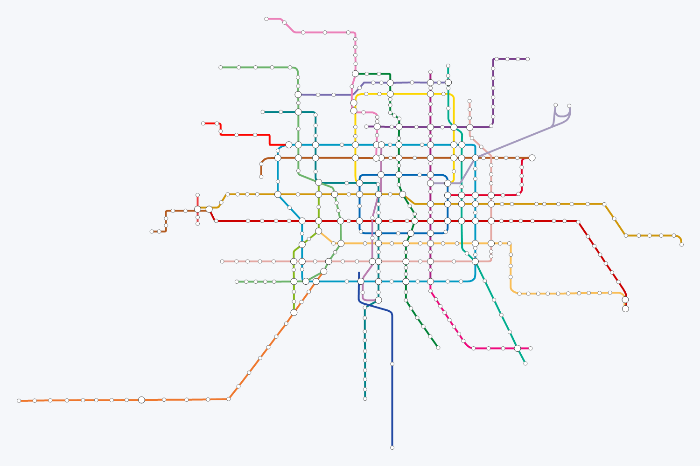

# 全国城市地铁可视化系统 — 第一步：数据获取与处理报告

**日期**：2026-08-14
**数据源**：高德地图地铁专题页（[map.amap.com/subway](http://map.amap.com/subway/index.html)）公开接口
**状态**：✅ 完成

---

## 一、做了什么

1. 编写并运行抓取脚本，从高德地铁页面的公开 JSON 接口获取 **41 个已开通地铁城市** 的原始数据（城市列表、线路、站点、轨迹）。
2. 编写并运行清洗脚本，将原始数据转换为前端可直接使用的 JSON 数据集。
3. 对全部数据进行结构与渲染双重校验，并输出本报告。

## 二、数据源说明

高德地铁页面的数据接口（与页面自身使用完全相同的公开接口，无需 API Key）：

| 内容 | 地址 |
| --- | --- |
| 城市列表 | `http://map.amap.com/subway/index.html` |
| 单城市线路/站点 | `http://map.amap.com/service/subway?srhdata=<城市ID>_drw_<拼音>.json` |

> ⚠️ 合规提示：以上数据来自高德公开网页，仅用于学习演示。请遵守高德服务条款，控制请求频率（脚本默认每次请求间隔 0.4 秒）。

## 三、脚本与数据文件

### 脚本

| 文件 | 作用 |
| --- | --- |
| `scripts/fetch_subway_data.py` | 抓取城市列表 + 41 个城市原始 JSON（支持断点续抓，已缓存自动跳过） |
| `scripts/build_dataset.py` | 清洗、去重、统计，输出前端 JSON |

重新执行：

```bash
python scripts/fetch_subway_data.py --raw-dir work/raw --delay 0.4
python scripts/build_dataset.py --raw-dir work/raw --out-dir data
```

### 输出数据

| 文件 | 说明 |
| --- | --- |
| `data/cities.json` | 全国概览用：41 个城市的汇总指标（线路数、站点数、估算里程、中心坐标等） |
| `data/cities/<拼音>.json` | 单城市详情：线路、站点、轨迹、换乘信息（如 `beijing.json`） |
| `work/raw/` | 原始抓取数据（中间产物） |

## 四、数据字段说明

### `cities.json`（全国概览）

```json
{
  "id": "1100",
  "name": "北京",
  "pinyin": "beijing",
  "adcode": "1100",
  "lng": 116.387,
  "lat": 39.923,
  "lineCount": 27,
  "stationCount": 411,
  "transferCount": 106,
  "estimatedNetworkKm": 818.7
}
```

### `data/cities/beijing.json`（单城市详情）

```json
{
  "id": "1100",
  "name": "北京",
  "center": {"lng": 116.387, "lat": 39.923},
  "bounds": {"minLng": ..., "maxLng": ..., "minLat": ..., "maxLat": ...},
  "stats": {"lineCount": 27, "stationCount": 411, "transferCount": 106, "estimatedNetworkKm": 818.7},
  "lines": [
    {
      "id": "900000069871",
      "name": "S1线",
      "fullName": "S1线",
      "branch": "",
      "color": "#B35A1F",
      "path": [[601.0, 944.0], [623.0, 944.0], "..."],
      "stationIds": ["...", "..."]
    }
  ],
  "stations": [
    {
      "id": "110100023110052",
      "name": "苹果园",
      "pinyin": "PingGuoYuan",
      "x": 861.0, "y": 845.0,
      "lng": 116.179, "lat": 39.926,
      "transfer": true,
      "lineIds": ["..."],
      "lineNames": ["1号线八通线", "6号线", "S1线"]
    }
  ]
}
```

**关键设计**：每个站点同时保留两套坐标——

- `x` / `y`：高德示意图坐标，与高德官方地铁图一致的“美化版线网布局”，适合绘制清晰可读的地铁线路图；
- `lng` / `lat`：真实经纬度，用于全国地图气泡定位、城市中心计算和站点提示信息。

## 五、关键统计

| 指标 | 数值 |
| --- | --- |
| 已开通地铁城市 | **41** |
| 线路总数 | **350** |
| 站点总数（按站去重） | **6,506** |
| 换乘站总数 | **1,011** |
| 估算运营网络总里程 | **≈ 11,259 km** |

### Top 10 城市（按站点数）

| 城市 | 线路数 | 站点数 | 换乘站 | 估算里程 (km) |
| --- | ---: | ---: | ---: | ---: |
| 上海 | 24 | 418 | 93 | 840.8 |
| 北京 | 27 | 411 | 106 | 818.7 |
| 深圳 | 17 | 363 | 71 | 600.6 |
| 成都 | 18 | 358 | 83 | 656.6 |
| 广州 | 23 | 333 | 74 | 746.4 |
| 杭州 | 16 | 296 | 46 | 558.7 |
| 武汉 | 13 | 289 | 42 | 513.6 |
| 重庆 | 15 | 273 | 52 | 521.1 |
| 南京 | 14 | 251 | 32 | 534.7 |
| 西安 | 12 | 247 | 36 | 393.7 |

## 六、数据质量验证

- ✅ 结构校验：41/41 城市无缺失字段、无重复站点 ID、无空线路轨迹、全部颜色为合法十六进制色值；
- ✅ 坐标校验：全部 6,506 个站点均同时具备示意图坐标和真实经纬度，城市中心均落在中国范围内；
- ✅ 渲染校验：北京（27 线）、上海（21 色）、深圳、成都、西安的示意图轨迹全部按线路颜色成功渲染（详见 `work/preview/` 下的预览图）。

示例预览（北京线网）：



## 七、已知说明与局限

1. **里程为估算值**：高德接口不直接提供运营里程，脚本按“相邻站点真实经纬度间距之和（重复段去重）”估算网络长度，与官方公布数值接近但非官方口径。
2. **客流数据源已失效**：用户建议的 `api.simbawu.com` 已不可用（HTTP 404）。后续步骤将生成**明确标注为示例数据**的客流趋势数据（如近 15 日客流量），用于演示图表交互。
3. **数据时效**：数据来自高德页面当前版本（2026-08-14 抓取），线路/站点会随高德更新；重新运行脚本即可刷新。
4. **线网布局**：示意图坐标为高德美化后的布局，非严格地理投影；这是地铁图“可读性优先”的常见做法。

## 八、下一步建议

✅ 第一步（数据获取与处理）已完成，等待确认后进入：

1. **搭建前端项目骨架**：React + Vite + ECharts，配置路由与卡片式布局；
2. 全国概览视图（中国地图 + 城市气泡 + 点击下钻）；
3. 单城市详情视图（线网渲染 + 悬停/点击交互）；
4. 数据面板（关键指标 + 示例客流趋势）；
5. 部署为可公开访问的网站。
