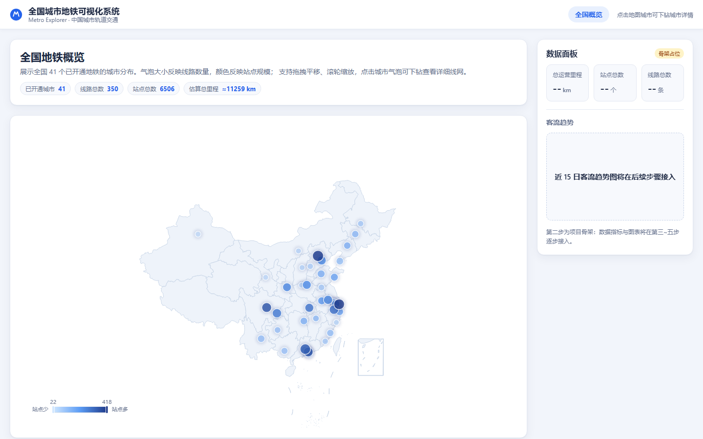

# 全国城市地铁可视化系统 — 第三步：全国概览视图

**日期**：2026-08-14
**状态**：✅ 完成

---

## 一、完成内容

### 1. 中国地图（ECharts Geo）

- 地图数据：阿里 DataV 公开的全国省级行政区划 GeoJSON（`data/maps/china.json`，35 个省级单位），构建时作为独立懒加载 chunk（582 KB），不增加首屏负担；
- 支持**拖拽平移 + 滚轮缩放**（`roam: true`，缩放范围 1x ~ 10x）；
- 省级区域使用浅色底 + 淡蓝高亮，与整体卡片式 UI 风格统一；
- 与高德数据同属 GCJ-02 坐标系，气泡与地图严格对齐。

### 2. 城市气泡

- 41 个已开通地铁城市全部展示；
- **气泡大小反映线路数量**（平方根缩放，北京最大）；
- **气泡颜色反映站点规模**（右下角连续型图例：浅蓝 → 深蓝）；
- 悬停显示站点卡片：线路数、站点数、换乘站数、估算里程，并提示可点击下钻。

### 3. 点击下钻

- 点击任意城市气泡 → 跳转到 `/city/<拼音>` 单城市详情页（当前为占位，第四步接入线网图）。

### 4. 概览统计条

- 页面顶部实时展示全国汇总：已开通城市 41、线路总数 350、站点总数 6,506、估算总里程 ≈ 11,259 km（数据来自第一步的 `data/cities.json`）。

### 5. 一个真实问题的修复

头一轮验证发现：在京津、长三角、珠三角等都市圈，城市间距近导致气泡互相重叠，
且较小的城市（如天津、东莞）反而盖住了大城市，导致点击北京却无法下钻。
修复：气泡改为**按线路数升序绘制**（大城市位于最上层）+ 略微缩小气泡尺寸，
保证高频点击的大城市始终可点；密集区域用户可先放大再点击。

## 二、验证结果（无头浏览器真实渲染）

| 检查项 | 结果 |
| --- | --- |
| 页面加载（无控制台/页面错误） | ✅ 0 错误 |
| 地图省级区域渲染 | ✅ 86,030 个区域色像素 |
| 城市气泡渲染 | ✅ 1,308 个气泡色像素 |
| 概览统计条 | ✅ 41 城 / 350 线 / 6,506 站 / ≈11,259 km |
| 悬停提示（北京：线路 27） | ✅ 命中 |
| **点击北京气泡 → `/city/beijing`** | ✅ 跳转成功 |

渲染效果见截图：

## 三、涉及文件

- `src/pages/NationalOverview.jsx` — 全国概览页面（地图 + 气泡 + 下钻）
- `src/components/EChart.jsx` — 可复用 ECharts 组件（挂载/卸载/缩放/事件）
- `src/lib/echarts.js` — ECharts 按需注册（减小包体积）
- `data/maps/china.json` — 中国地图 GeoJSON

## 四、下一步

✅ 第三步（全国概览视图）已完成，等待确认后进入：

**第四步：单城市详情视图** —— 使用第一步清洗好的示意图坐标渲染北京线网（线路颜色区分、站点名称、悬停站点信息、点击高亮所属线路）。
