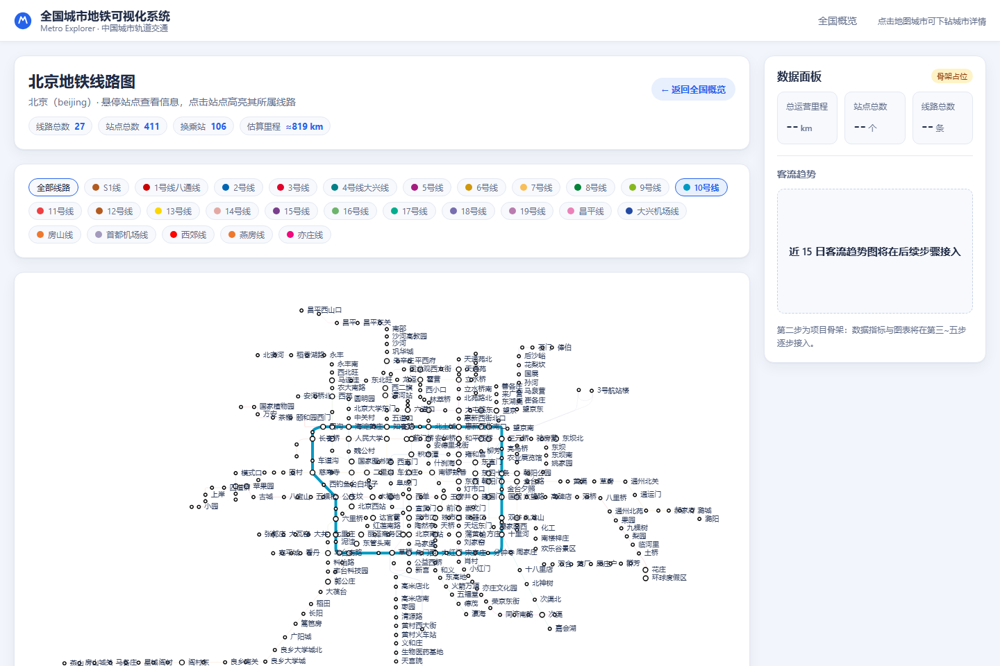

# 全国城市地铁可视化系统 — 第四步：单城市详情视图

**日期**：2026-08-14
**状态**：✅ 完成

---

## 一、完成内容

### 1. 线网渲染（以北京为例，支持全部 41 城）

- 城市数据通过第一步生成的懒加载索引按需加载（`/city/beijing` 只加载北京 130 KB 的 JSON chunk）；
- 使用高德示意图坐标（与高德官方地铁图一致的布局），每个站点保留真实经纬度用于提示信息；
- **线路**：`lines` 折线序列，每条线路使用其专属颜色（1 号线红、2 号线蓝、10 号线青…）；
- **站点**：白色圆点 + 线路色描边，换乘站更大；**站点名称**常显，标签重叠时自动隐藏（`hideOverlap`），放大后逐渐展开；
- 支持**拖拽平移 + 滚轮缩放**（类地图操作，`dataZoom` inside）。

### 2. 交互

| 操作 | 效果 |
| --- | --- |
| 悬停站点 | 弹出卡片：站点名、普通/换乘、所属线路（带颜色标识）、真实坐标 |
| 点击站点 | **高亮该站所属的全部线路**，其余线路变暗（12% 不透明度） |
| 点击线路 | 高亮该线路 |
| 点击线路图例色块 | 高亮对应线路；再次点击取消；「全部线路」一键恢复 |
| 点击空白处 | 恢复全部线路 |

### 3. 页面信息

- 页头：城市名、返回全国概览按钮、城市统计（线路 27 / 站点 411 / 换乘 106 / 估算 ≈819 km）；
- 线路图例：27 条北京线路的彩色标签，与图中颜色一一对应。

## 二、验证结果（无头浏览器真实渲染 + 像素级校验）

| 检查项 | 结果 |
| --- | --- |
| 深链接 `/city/beijing` 直接访问 | ✅ 正常（修复了相对路径资源加载问题） |
| 页面统计 | ✅ 27 线 / 411 站 / 106 换乘 / ≈819 km |
| 线路颜色渲染 | ✅ 1号线 1,482 px、10号线 1,856 px、4号线 1,014 px、13号线 769 px |
| 悬停「天安门东」 | ✅ 显示站点名、所属线路 1号线八通线、坐标 |
| 点击站点高亮 | ✅ 图例仅高亮「1号线八通线」 |
| 点击线路图例 | ✅ 仅高亮「10号线」 |
| 高亮后的视觉差异 | ✅ 1号线红色像素 1,482 → 328（被调暗），10号线满强度 |
| 控制台/页面错误 | ✅ 0 |

渲染效果：

## 三、过程中修复的问题

1. **深链接资源加载失败**：此前构建使用相对资源路径，直接访问 `/city/beijing` 时 JS 被 SPA 回退成 HTML。
   已改为绝对路径构建 + 静态服务器仅对无扩展名路径做 SPA 回退，缺失资源返回 404。

## 四、下一步

✅ 第四步（单城市详情视图）已完成，等待确认后进入：

**第五步：数据面板集成** —— 侧边面板接入真实指标（全国/城市随视图切换），并加入示例客流趋势图（近 15 日，明确标注为示例数据）。
