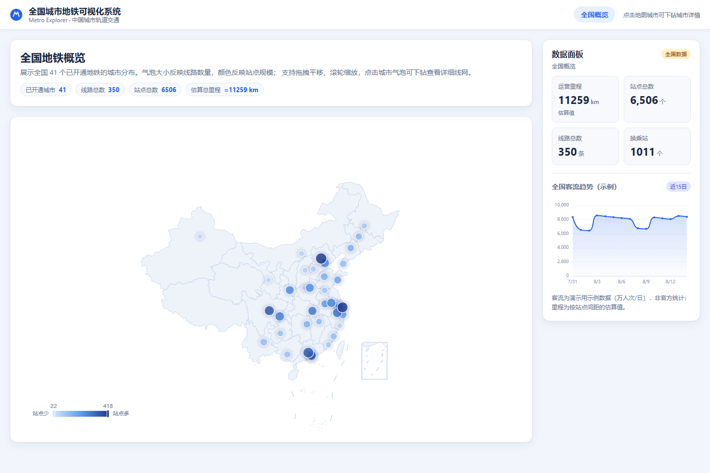
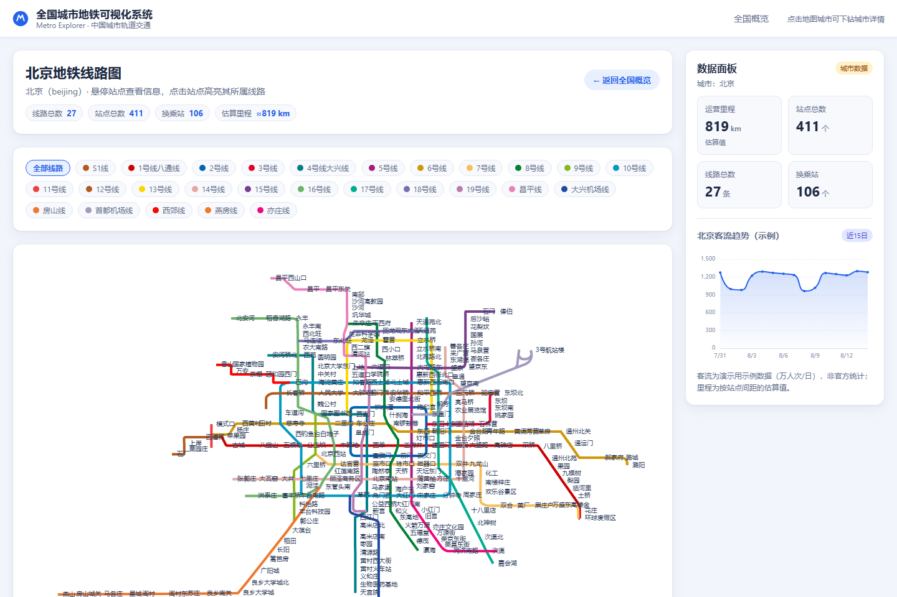

# 全国城市地铁可视化系统 — 第五步：数据面板集成

**日期**：2026-08-14
**状态**：✅ 完成

---

## 一、完成内容

### 1. 关键指标（随视图自动切换）

侧边数据面板根据当前路由展示对应数据：

| 视图 | 运营里程 | 站点总数 | 线路总数 | 换乘站 |
| --- | ---: | ---: | ---: | ---: |
| 全国概览 | ≈11,259 km | 6,506 | 350 | 1,011 |
| 北京 | ≈819 km | 411 | 27 | 106 |
| 上海 | ≈841 km | 418 | 24 | 93 |

- 全国视图取 `data/cities.json` 汇总；城市视图无需等待详情页加载，直接用城市汇总数据即时显示；
- 里程为估算值（按相邻站点间距去重求和），面板中已标注。

### 2. 示例客流趋势图（近 15 日）

- 折线 + 渐变面积图，单位万人次/日；
- 数据为**确定性生成的演示数据**：以城市规模为基数，叠加工作日/周末规律和轻微波动，刷新页面数值稳定；
- 面板标题与提示中明确标注「示例」，非官方统计；
- 全国视图显示全国客流趋势，城市视图显示对应城市趋势。

## 二、验证结果（无头浏览器实测三个视图）

| 检查项 | 全国 | 北京 | 上海 |
| --- | --- | --- | --- |
| 面板上下文 | ✅ 全国概览 | ✅ 城市：北京 | ✅ 城市：上海 |
| 四项指标 | ✅ 全部正确 | ✅ 全部正确 | ✅ 全部正确 |
| 趋势图渲染（蓝色折线像素） | ✅ 10,215 | ✅ 10,663 | ✅ 10,868 |
| 控制台错误 | ✅ 0 | ✅ 0 | ✅ 0 |

界面效果：

## 三、涉及文件

- `src/components/DashboardPanel.jsx` — 指标面板 + 客流趋势图
- `src/styles/global.css` — 面板两列指标卡、趋势图样式

## 四、下一步

✅ 第五步（数据面板集成）已完成，等待确认后进入：

**第六步：完善与测试** —— 全面功能回归（路由/地图/线网/面板）、响应式检查、边界情况（无效城市、加载失败）、性能与细节优化。
随后可进行**部署**：将构建产物发布为可公开访问的静态网站。
